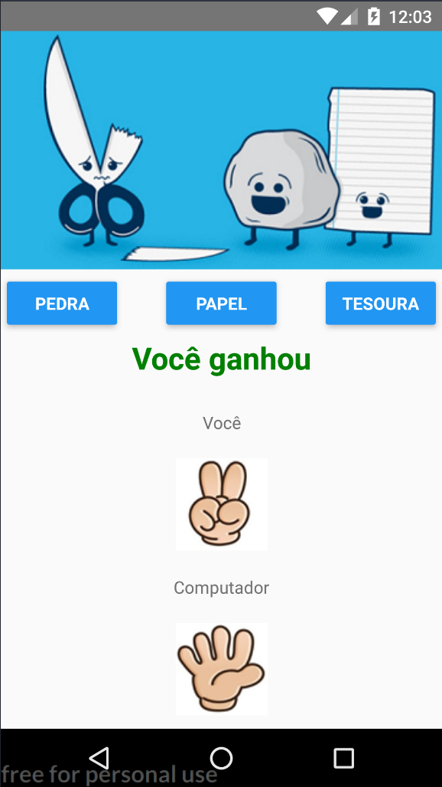

# Game Jokenpô

Desenvolvedor Multiplataforma Android/IOS com React e Redux 

Nesse App você aprenderá conceitos muito importantes sobre o controle de estado dos componentes do React (props e states) e também será introduzido ao conceito de modularização para o reaproveitamento de código.

